# TikTok Streak Bot


- Bot otomatis streak TikTok: kirim pesan ke banyak percakapan via Puppeteer
- Dijalankan sepenuhnya di GitHub Actions, tidak perlu PC nyala
- Konfigurasi via `config.json`, cookie via GitHub Secrets, notifikasi Discord

> [!WARNING]
> **This TikTok Streak Bot is illegal. Use it at your own risk.**
>
> This project is provided for educational and experimental purposes only. By using this bot, you acknowledge that you are responsible for your own actions and any consequences that may result from its use.

## Features

- Login pakai session cookie TikTok (env `COOKIES_JSON` atau `cookies.json` lokal)
- Kirim pesan otomatis ke N percakapan dengan jeda configurable
- Mode pesan statis atau kutipan acak dari `dummyjson.com/quotes/random`
- Cron otomatis dua kali sehari di GitHub Actions + `workflow_dispatch` manual
- Notifikasi status run ke Discord webhook

## Structure of the Repo

| Path | Description |
| :--- | :--- |
| `.github/` | Workflow Actions, CodeQL, Dependabot |
| `config.json` | Semua opsi perilaku bot (pesan, delay, dsb) |
| `index.js` | Bot Puppeteer: launch, inject cookie, kirim pesan |
| `package.json` | Manifest npm: dependency Puppeteer, figlet, kleur |

## Description of Files

| File | Description | Cluster |
| :--- | :--- | :--- |
| `.gitignore` | Abaikan `node_modules/`, `cookies.json`, `.env` | Config |
| `.github/codeql.yml` | CodeQL: analisis keamanan mingguan, per push | Security |
| `.github/dependabot.yml` | Dependabot: update npm + Actions | Maintenance |
| `.github/workflows/...` | Cron 22:00/00:00 WIB, run bot, notif | Automation |
| `config.json` | Opsi bot: pesan, jumlah user, semua delay, headless | Config |
| `index.js` | Automasi UI TikTok messages: iframe, editor, Ctrl+Enter | Bot Logic |
| `package-lock.json` | Lockfile dependency npm | Config |
| `package.json` | Manifest npm dan scripts | Config |
| `README.md` | Dokumentasi ini | Docs |

## Setup

### 1. Fork or clone

Fork repo ini ke akun GitHub kamu, atau clone lokal lalu push ke repo sendiri.

> **Note:** Public repository aman dipakai karena cookie sensitif disimpan di
> GitHub Actions Secrets, bukan di kode.

### 2. Configure `COOKIES_JSON`

Bot autentikasi pakai session cookie TikTok.

- **Never** taruh cookie langsung di source code atau commit ke repo
- Simpan sebagai GitHub Actions Secret

#### Export cookies

Pakai extension export cookie seperti EditThisCookie. Format yang diharapkan:

```json
[
  {
    "name": "sessionid",
    "value": "xxx",
    "domain": ".tiktok.com"
  }
]
```

#### Add the secret

1. Buka repo kamu di GitHub
2. Masuk **Settings > Secrets and variables > Actions**
3. Klik **New repository secret**
4. Isi:
   - **Name:** `COOKIES_JSON`
   - **Secret:** hasil export cookie (boleh di-compress jadi satu baris)
5. Save

Opsional: set secret `DISCORD_WEBHOOK` untuk notifikasi status run.

> [!CAUTION]
> **Treat your TikTok cookies like a password.**
>
> Anyone who obtains valid session cookies may potentially access your TikTok
> session. Never publish them, commit them to Git, or share them with anyone.

### 3. Configure `config.json`

```json
{
  "message": "API",
  "useQuotesAPi": true,
  "totalUsers": 14,
  "actionDelayMs": 300,
  "typeDelayMs": 0,
  "afterSendDelayMs": 500,
  "afterClickDelayMs": 300,
  "pageLoadDelayMs": 5000,
  "finishDelayMs": 3000,
  "headless": false,
  "bannerFont": "DOS Rebel",
  "targetUrl": "https://www.tiktok.com/messages?lang=en"
}
```

| Key | Description | Repo |
| :-- | :-- | :-- |
| `message` | Pesan yang dikirim ke tiap percakapan | `"API"` |
| `useQuotesAPi` | `true` mengganti pesan jadi kutipan acak dummyjson | `true` |
| `totalUsers` | Jumlah percakapan yang diproses | `14` |
| `actionDelayMs` | Jeda antar percakapan (ms) | `300` |
| `typeDelayMs` | Jeda per karakter saat mengetik (ms) | `0` |
| `afterSendDelayMs` | Jeda setelah mengetik dan setelah kirim (ms) | `500` |
| `afterClickDelayMs` | Jeda setelah klik elemen (ms) | `300` |
| `pageLoadDelayMs` | Tunggu halaman siap (ms) | `5000` |
| `finishDelayMs` | Jeda sebelum browser ditutup (ms) | `3000` |
| `headless` | Jalankan Chromium headless | `false` |
| `bannerFont` | Font banner figlet | `"DOS Rebel"` |
| `targetUrl` | URL messaging TikTok | TikTok messages |

## Description of Executables

- Tidak ada file executable; satu-satunya tool adalah `index.js`, dijalankan
  lewat `node` atau GitHub Actions

### `index.js`

- Launch Chromium via Puppeteer, inject cookies dari env atau file
- Buka halaman messaging, dismiss modal awal, loop kirim pesan
- Kirim dengan `Ctrl+Enter`, log sukses/gagal per user, summary di akhir

- Jalankan normal:
  ```bash
  > npm install
  > node index.js
  ```

- Jalankan dengan log detail per langkah:
  ```bash
  > node index.js --debug
  ```

- Jalankan dengan cookie lokal tanpa env:
  ```bash
  > COOKIES_JSON="$(cat cookies.json)" node index.js
  ```

> **Note:** Mode lokal memakai `cookies.json` (sudah di-gitignore) jika env
> `COOKIES_JSON` tidak diset. Keduanya menerima array cookie (normal), atau
> satu objek cookie tunggal yang dibungkus otomatis.

## Description of Workflows

### Via GitHub Actions (disarankan)

- Trigger: cron dua kali sehari di `.github/workflows/TikTok-Streak.yml`:
  - `15:00 UTC` = 22:00 WIB
  - `17:00 UTC` = 00:00 WIB
- Manual kapan saja: **Actions > TikTok Streak > Run workflow**
- Notifikasi Discord terkirim setiap run selesai, sukses atau gagal

### Run lokal

- Utamakan untuk debug; langkah ada di `Description of Executables`
- Bila headless diblokir TikTok, lihat `Troubleshooting`

## Description of Architecture

- Alur satu run bot, satu arah dari trigger ke notifikasi:

```mermaid
flowchart LR
  A[Trigger: cron atau workflow_dispatch] --> B[Actions runner: windows-latest]
  B --> C[npm install dependencies]
  C --> D[node index.js: load cookies]
  D --> E[Puppeteer: launch Chromium no-sandbox]
  E --> F[Set cookie, buka targetUrl]
  F --> G[iframe messages, dismiss modal]
  G --> H[Loop totalUsers: klik, ketik, Ctrl+Enter]
  H --> I[Summary Success/Failed]
  I --> J[Discord webhook: status run]
```



- Modul `index.js`:
  - Config: `loadConfig()` membaca `config.json`, error jika invalid
  - Credentials: env `COOKIES_JSON` dulu, lalu file `cookies.json` lokal;
    array cookie atau objek tunggal dibungkus otomatis
  - Navigation: viewport 1280x800, `networkidle2`, tunggu `pageLoadDelayMs`
  - Modal: klik di luar `_TUXModal-wrapper` bila muncul dalam 3 detik
  - Loop: selector `div[data-index="i"]` per percakapan; error per user
    ditangkap try/catch individu, satu gagal tidak menghentikan run
  - Message: statis dari `config.message` atau kutipan acak `fetchQuote()`
- Workflow Actions `.github/workflows/TikTok-Streak.yml`:
  - `runs-on: windows-latest`, Node 20 via `actions/setup-node@v4`
  - Secret `COOKIES_JSON` di-inject ke env step run
  - Discord notification via `tsickert/discord-webhook@v7.0.0`, `if: always()`

## Troubleshooting

### Cookies expired

- Export ulang cookie dari browser
- Replace secret `COOKIES_JSON`
- Run ulang workflow

### TikTok UI changed

- Selector di `index.js` perlu diupdate
- Yang mungkin berubah: selector iframe messages, `data-e2e` conversation item,
  selector editor `public-DraftEditor-content`
- Cek dengan `node index.js --debug` untuk lihat langkah gagal

### Workflow fails

- Cek log di **GitHub > Actions > TikTok Streak**
- Log menunjukkan step mana yang gagal

### Headless diblokir TikTok

- Coba set `"headless": false`
- Atau naikkan `pageLoadDelayMs` dan `actionDelayMs`

## Disclaimer

- Project ini **tidak berafiliasi dengan, diendorse, atau disponsori TikTok**
- Owner repo menyediakan project as-is tanpa menanggung risiko penggunaan
- Kamu bertanggung jawab atas risiko, batasan, dan konsekuensi pemakaian bot

> **Use responsibly. You've been warned.**
