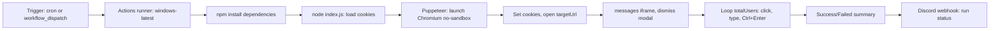

# TikTok Streak Bot


- Automatic TikTok streak bot: sends messages to many conversations via Puppeteer
- Runs entirely on GitHub Actions, no need to keep your PC on
- Behavior configured via `config.json`, cookies via GitHub Secrets, Discord notifications

> [!WARNING]
> **This TikTok Streak Bot is illegal. Use it at your own risk.**
>
> This project is provided for educational and experimental purposes only. By using this bot, you acknowledge that you are responsible for your own actions and any consequences that may result from its use.

## Features

- Login using TikTok session cookies (env `COOKIES_JSON` or local `cookies.json`)
- Automatically send messages to N conversations with configurable delays
- Static message mode or random quotes from `dummyjson.com/quotes/random`
- Automatic cron twice a day on GitHub Actions + manual `workflow_dispatch`
- Run status notifications to a Discord webhook
- Docker image for self-hosted runs

## Repository Structure

| Path | Description |
| :--- | :--- |
| `.github/` | Actions workflows, CodeQL, Dependabot |
| `config.json` | All bot behavior options (message, delays, etc.) |
| `index.js` | Puppeteer bot: launch, inject cookies, send messages |
| `package.json` | npm manifest: Puppeteer, figlet, kleur dependencies |
| `Dockerfile` | Self-hosted container image |

## Docker

```bash
docker build -t tiktok-streak .
docker run --rm \
  -e COOKIES_JSON="$(cat cookies.json)" \
  -e HEADLESS=true \
  tiktok-streak
```

Config can be overridden via environment variables: `CONFIG_JSON` (full JSON), `HEADLESS`, `TOTAL_USERS`, `MESSAGE`, `COOKIES_JSON`.

For a schedule, run the container on a cron job, e.g.:

```cron
0 9,17 * * * docker run --rm -e COOKIES_JSON='[...]' tiktok-streak
```

## Setup

### 1. Fork or clone

Fork this repo to your GitHub account, or clone locally and push to your own repo.

> **Note:** Using a public repository is safe because sensitive cookies are stored in
> GitHub Actions Secrets, not in the code.

### 2. Configure `COOKIES_JSON`

The bot authenticates using TikTok session cookies.

- **Never** put cookies directly in the source code or commit them to the repo
- Store them as a GitHub Actions Secret

#### Export cookies

Use a cookie export extension such as EditThisCookie. Expected format:

```json
[
  {
    "name": "sessionid",
    "value": "xxx",
    "domain": ".tiktok.com"
  }
]
```

#### Add the secret

1. Open your repo on GitHub
2. Go to **Settings > Secrets and variables > Actions**
3. Click **New repository secret**
4. Fill in:
   - **Name:** `COOKIES_JSON`
   - **Secret:** the exported cookies (can be minified to a single line)
5. Save

Optional: set the `DISCORD_WEBHOOK` secret for run status notifications.

> [!CAUTION]
> **Treat your TikTok cookies like a password.**
>
> Anyone who obtains valid session cookies may potentially access your TikTok
> session. Never publish them, commit them to Git, or share them with anyone.

### 3. Configure `config.json`

```json
{
  "message": "API",
  "useQuotesAPi": true,
  "totalUsers": 14,
  "actionDelayMs": 300,
  "typeDelayMs": 0,
  "afterSendDelayMs": 500,
  "afterClickDelayMs": 300,
  "pageLoadDelayMs": 5000,
  "finishDelayMs": 3000,
  "headless": false,
  "bannerFont": "DOS Rebel",
  "targetUrl": "https://www.tiktok.com/messages?lang=en"
}
```

| Key | Description | Default |
| :-- | :-- | :-- |
| `message` | Message sent to each conversation | `"API"` |
| `useQuotesAPi` | `true` replaces the message with a random dummyjson quote | `true` |
| `totalUsers` | Number of conversations to process | `14` |
| `actionDelayMs` | Delay between conversations (ms) | `300` |
| `typeDelayMs` | Delay per character while typing (ms) | `0` |
| `afterSendDelayMs` | Delay after typing and after sending (ms) | `500` |
| `afterClickDelayMs` | Delay after clicking an element (ms) | `300` |
| `pageLoadDelayMs` | Wait for the page to be ready (ms) | `5000` |
| `finishDelayMs` | Delay before the browser closes (ms) | `3000` |
| `headless` | Run Chromium headless | `false` |
| `bannerFont` | figlet banner font | `"DOS Rebel"` |
| `targetUrl` | TikTok messaging URL | TikTok messages |

## Executables

- No separate executables; the only tool is `index.js`, run via `node` or GitHub Actions

### `index.js`

- Launches Chromium via Puppeteer, injects cookies from env or file
- Opens the messaging page, dismisses the initial modal, loops message sending
- Sends with `Ctrl+Enter`, logs success/failure per user, summary at the end

- Run normally:
  ```bash
  npm install
  node index.js
  ```

- Run with detailed per-step logs:
  ```bash
  node index.js --debug
  ```

- Run with local cookies without env:
  ```bash
  COOKIES_JSON="$(cat cookies.json)" node index.js
  ```

> **Note:** Local mode uses `cookies.json` (already gitignored) when the
> `COOKIES_JSON` env var is not set. Both accept a cookie array (normal) or a
> single cookie object which is auto-wrapped.

## Workflows

### Via GitHub Actions (recommended)

- Trigger: cron twice a day in `.github/workflows/TikTok-Streak.yml`:
  - `15:00 UTC` = 22:00 WIB
  - `17:00 UTC` = 00:00 WIB
- Manual at any time: **Actions > TikTok Streak > Run workflow**
- Discord notification is sent after every run, success or failure

### Local run

- Preferred for debugging; see Executables above
- If headless is blocked by TikTok, see Troubleshooting

## Architecture

- Single one-way flow of a bot run, from trigger to notification:


```mermaid
flowchart LR
  A[Trigger: cron or workflow_dispatch] --> B[Actions runner: windows-latest]
  B --> C[npm install dependencies]
  C --> D[node index.js: load cookies]
  D --> E[Puppeteer: launch Chromium no-sandbox]
  E --> F[Set cookies, open targetUrl]
  F --> G[messages iframe, dismiss modal]
  G --> H[Loop totalUsers: click, type, Ctrl+Enter]
  H --> I[Success/Failed summary]
  I --> J[Discord webhook: run status]
```

- `index.js` module:
  - Config: `loadConfig()` reads `config.json` or `CONFIG_JSON` env, errors on invalid
  - Credentials: env `COOKIES_JSON` first, then local `cookies.json`;
    cookie array or single object auto-wrapped
  - Navigation: viewport 1280x800, `networkidle2`, wait `pageLoadDelayMs`
  - Modal: click outside `_TUXModal-wrapper` if it appears within 3 seconds
  - Loop: selector `div[data-index="i"]` per conversation; per-user errors are
    caught individually, one failure does not stop the run
  - Message: static from `config.message` or random quote via `fetchQuote()`
- Actions workflow `.github/workflows/TikTok-Streak.yml`:
  - `runs-on: windows-latest`, Node 22 via `actions/setup-node`
  - Secret `COOKIES_JSON` injected into the run step env
  - Discord notification via `tsickert/discord-webhook`, `if: always()`

## Troubleshooting

### Cookies expired

- Re-export cookies from your browser
- Replace the `COOKIES_JSON` secret
- Re-run the workflow

### TikTok UI changed

- The selectors in `index.js` need updating
- Likely candidates: messages iframe selector, `data-e2e` conversation item,
  editor selector `public-DraftEditor-content`
- Check with `node index.js --debug` to see which step fails

### Workflow fails

- Check logs in **GitHub > Actions > TikTok Streak**
- The logs show which step failed

### Headless blocked by TikTok

- Try setting `"headless": false`
- Or increase `pageLoadDelayMs` and `actionDelayMs`

## Disclaimer

- This project is **not affiliated with, endorsed by, or sponsored by TikTok**
- The repo owner provides this project as-is without liability for its use
- You are responsible for the risks, limits, and consequences of using this bot

> **Use responsibly. You've been warned.**
